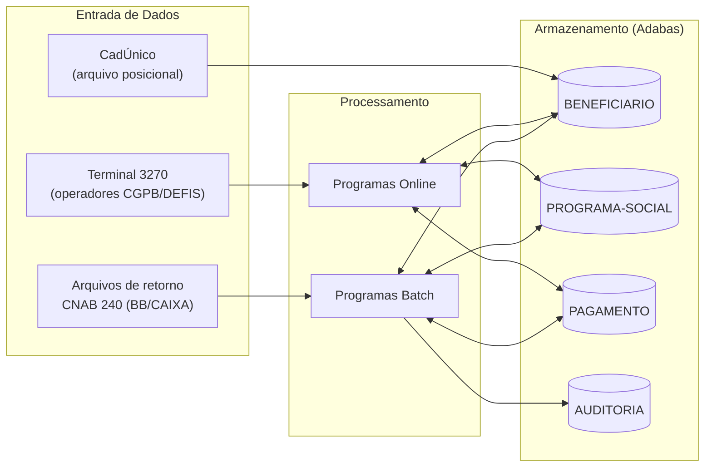
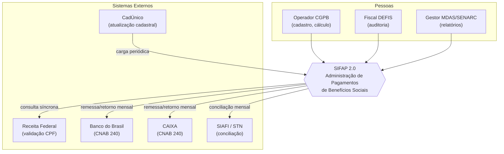

<!-- markdownlint-disable MD013 MD025 MD026 MD028 MD029 MD034 MD040 MD051 MD060 -->

# Mapa de Dependências — SIFAP Legado

  

> 🗺 **Você está aqui:** [Kit PT-BR](../README.md) → [Estágio 1](README.md) → **dependency-map**

> **Para quem é isto?** Este é um **artefato preenchido pelo time** durante o Estágio 1 (Arqueologia).
>
> **O que você terá ao final do estágio:**
>
> 1. Este documento totalmente preenchido com os dados reais do legado SIFAP
> 2. Rastreabilidade para `01-arqueologia/legado-sifap/` (programas `.NSN` e DDMs)
> 3. Base de evidência usada nas EARS do Estágio 2 (`source_legacy:`)
>
> 📘 **Guia passo a passo:** [`GUIDE.md`](GUIDE.md).

> Use diagramas Mermaid para mapear as dependências entre programas Natural e DDMs Adabas.
> O objetivo é visualizar "quem chama quem" e "quem lê/escreve o quê".

## Como descobrir dependências

- Use `grep` ou Copilot Chat para listar todas as ocorrências de `CALLNAT` nos 15 arquivos `.NSN`.
- Prompt útil: _"Liste todas as ocorrências de CALLNAT nestes arquivos e desenhe um diagrama Mermaid."_
- Para leitura/escrita em DDMs: procure por `READ`, `READ LOGICAL`, `STORE`, `UPDATE`, `DELETE`.

## Diagrama de Dependências entre Programas

> Mapa real do SIFAP legado: **15 programas Natural + 4 DDMs Adabas**, sem órfãos.
> Nota de leitura: no legado **não há `CALLNAT`** entre os programas de negócio — o acoplamento é via **dados compartilhados** (mesmos DDMs Adabas). `BATCHPGT` **reimplementa** a lógica de `CALCBENF`/`CALCDSCT` inline (duplicação), apesar do cabeçalho dizer "CHAMA CALCBENF E CALCDSCT".

```mermaid
flowchart TD
 subgraph ONLINE["Programas Online (3270)"]
   CADBENEF["CADBENEF.NSN<br/>Cadastro beneficiário"]
   CADDEPEND["CADDEPEND.NSN<br/>Cadastro dependentes"]
   CADPROG["CADPROG.NSN<br/>Cadastro programas"]
   CONSBENF["CONSBENF.NSN<br/>Consulta beneficiário"]
 end

 subgraph CALC["Cálculo (online)"]
   CALCBENF["CALCBENF.NSN<br/>Cálculo benefício"]
   CALCDSCT["CALCDSCT.NSN<br/>Cálculo descontos"]
   CALCCORR["CALCCORR.NSN<br/>Correção retroativa"]
 end

 subgraph VALID["Validação (online)"]
   VALBENEF["VALBENEF.NSN<br/>Valida cadastro"]
   VALDOCS["VALDOCS.NSN<br/>Valida documentos"]
   VALELEG["VALELEG.NSN<br/>Valida elegibilidade"]
 end

 subgraph BATCH["Programas Batch (JES2)"]
   BATCHPGT["BATCHPGT.NSN<br/>Folha mensal"]
   BATCHCON["BATCHCON.NSN<br/>Conciliação bancária"]
   BATCHREL["BATCHREL.NSN<br/>Relatórios consolidados"]
 end

 subgraph REL["Relatórios / Consulta"]
   RELPGT["RELPGT.NSN<br/>Relatório pagamentos"]
   RELAUDIT["RELAUDIT.NSN<br/>Relatório auditoria"]
 end

 subgraph DDMS["DDMs Adabas"]
   DB[("BENEFICIARIO<br/>FNR 150")]
   DP[("PROGRAMA-SOCIAL<br/>FNR 151")]
   DG[("PAGAMENTO<br/>FNR 152")]
   DA[("AUDITORIA<br/>FNR 153")]
 end

 subgraph EXT["Sistemas Externos"]
   RF{{"Receita Federal<br/>(CPF)"}}
   BB{{"Banco do Brasil<br/>(CNAB 240)"}}
   CX{{"CAIXA<br/>(CNAB 240)"}}
   SIAFI{{"SIAFI / STN"}}
   CADU{{"CadÚnico"}}
 end

 CADBENEF -->|READ/STORE/UPDATE| DB
 CADDEPEND -->|FIND/UPDATE PE| DB
 CADPROG -->|FIND/STORE| DP
 CONSBENF -->|FIND| DB
 CONSBENF -->|READ| DG

 CALCBENF -->|FIND| DB
 CALCBENF -->|FIND| DP
 CALCBENF -->|STORE| DG
 CALCDSCT -->|FIND| DG
 CALCDSCT -->|FIND PE| DB
 CALCDSCT -->|UPDATE| DG
 CALCCORR -->|READ/UPDATE| DG

 VALBENEF -.valida.-> DB
 VALDOCS -.valida.-> DB
 VALELEG -->|FIND| DB
 VALELEG -->|FIND| DP

 BATCHPGT -->|READ BY CPF| DB
 BATCHPGT -->|FIND| DP
 BATCHPGT -->|FIND/STORE| DG
 BATCHCON -->|FIND/UPDATE| DG
 BATCHCON -->|STORE| DA
 BATCHREL -->|READ| DG
 BATCHREL -->|FIND| DB

 RELPGT -->|READ| DG
 RELPGT -->|FIND| DB
 RELAUDIT -->|READ| DA

 RF -. consulta .-> CADBENEF
 BATCHPGT -. remessa .-> BB
 BATCHPGT -. remessa .-> CX
 BB -. retorno .-> BATCHCON
 CX -. retorno .-> BATCHCON
 BATCHCON -. concilia .-> SIAFI
 CADU -. atualiza .-> DB
```

> **Cadeia batch mensal (ordem obrigatória — MYS-009):** `BATCHPGT` → `BATCHCON` → `BATCHREL`. A ordem virou dependência da conciliação com o SIAFI; reordenar quebra integrações externas.

## Diagrama de Fluxo de Dados (DDMs)

## Tabela de Dependências

| Programa | Chama (CALLNAT) | Lê (READ/FIND) DDMs | Escreve (STORE/UPDATE) DDMs | Observações |
| -------- | --------------- | ------------------- | --------------------------- | ----------- |
| CADBENEF.NSN | — (subrotina interna VALIDA-CPF) | BENEFICIARIO | BENEFICIARIO | Suspende >75 anos (MYS-001) |
| CADDEPEND.NSN | — | BENEFICIARIO | BENEFICIARIO (PE DEPENDENTES) | Limite 5 deps hardcoded (MYS-002) |
| CADPROG.NSN | — | PROGRAMA-SOCIAL | PROGRAMA-SOCIAL | Fator-K 0.347215 (MYS-003) |
| CONSBENF.NSN | — | BENEFICIARIO, PAGAMENTO | — | Online; mascara CPF na tela |
| CALCBENF.NSN | — (subrotinas internas) | BENEFICIARIO, PROGRAMA-SOCIAL | PAGAMENTO | 13º/abono dezembro (MYS-004); trunca centavos (MYS-005) |
| CALCDSCT.NSN | — | PAGAMENTO, BENEFICIARIO (PE DESCONTOS) | PAGAMENTO | Teto 30% exceto judicial (MYS-006) |
| CALCCORR.NSN | — | PAGAMENTO | PAGAMENTO | IPCA até 2014; bloco "Plano Verão" morto (EGG-001) |
| VALBENEF.NSN | — | BENEFICIARIO (campos) | — | CPF 000… aceito (MYS-007) |
| VALDOCS.NSN | — | BENEFICIARIO (campos) | — | Backdoor prefixos de teste (MYS-010/EGG-002) |
| VALELEG.NSN | — | BENEFICIARIO, PROGRAMA-SOCIAL | — | Região 99 pula tudo (MYS-008) |
| BATCHPGT.NSN | — (**duplica** CALCBENF/CALCDSCT inline) | BENEFICIARIO (BY CPF), PROGRAMA-SOCIAL, PAGAMENTO | PAGAMENTO | Crítico; ordem por CPF é dependência externa |
| BATCHCON.NSN | — | PAGAMENTO, AUDITORIA, WORK FILE CNAB | PAGAMENTO, AUDITORIA | Concilia BB/SIAFI; Banco Real morto (EGG-003) |
| BATCHREL.NSN | — | PAGAMENTO, BENEFICIARIO | flat file (impressão) | Arredonda half-up (≠ CALCBENF → INC-004) |
| RELPGT.NSN | — | PAGAMENTO, BENEFICIARIO | flat file | Relatório analítico paginado |
| RELAUDIT.NSN | — | AUDITORIA | tela/impressão | Oculta ação `EX` do relatório (MYS-010) |

## Inventário de Integrações Externas (C4 L1 — contratos)

| Sistema externo | Direção | Mecanismo | Frequência | Criticidade | Risco de contrato |
| --------------- | ------- | --------- | ---------- | ----------- | ----------------- |
| **Receita Federal (CPF)** | SIFAP → RF | Consulta online (timeout 30s) | Por inclusão/alteração cadastral | Alta | Síncrono; indisponibilidade bloqueia cadastro |
| **Banco do Brasil** | SIFAP ↔ BB | Arquivo CNAB 240 (batch) | Mensal (remessa + retorno) | Crítica | Layout posicional fixo; canal principal de crédito |
| **CAIXA** | SIFAP ↔ CAIXA | Arquivo CNAB 240 (batch) | Mensal | Alta | Canal alternativo (desde 2004) |
| **SIAFI (STN)** | SIFAP ↔ SIAFI | Arquivo TXT (batch) | Mensal (conciliação) | Crítica | Conciliação por hash totalizador; depende da ordem batch |
| **CadÚnico** | CadÚnico → SIFAP | Arquivo posicional (batch) | Periódico | Média | Integração **não padronizada** (2006); fora do inventário oficial |

## Diagrama C4 — Nível 1 (Sistema em Contexto)

> **Leitura em 30 segundos:** três perfis de pessoas usam o SIFAP; o sistema valida CPF na Receita (síncrono), paga via BB/CAIXA (assíncrono, mensal), concilia com o SIAFI e recebe atualizações do CadÚnico. Esses 5 contratos externos não podem quebrar na modernização.

## Dependências Circulares

> Liste aqui qualquer dependência circular encontrada (programa A chama B que chama A):

- Nenhuma encontrada até agora.

## Programas Órfãos

> Programas que não são chamados por nenhum outro (possíveis pontos de entrada ou código morto):

- A investigar.

---

### Continuar a leitura

<table width="100%">
<tr>
<td width="50%" valign="top" align="left">
<strong>← ANTERIOR</strong> 
<a href="business-rules-catalog.md"><strong>business-rules-catalog.md</strong></a> 
Catálogo de regras.
</td>
<td width="50%" valign="top" align="right">
<strong>PRÓXIMO →</strong> 
<a href="discovery-report.md"><strong>discovery-report.md</strong></a> 
Síntese final.
</td>
</tr>
</table>

↑ <a href="README.md">Voltar ao Kit PT-BR</a>

