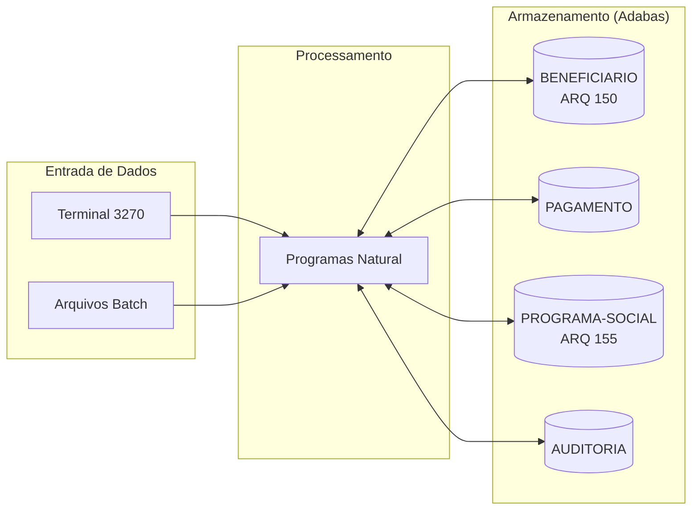

<!-- markdownlint-disable MD013 MD025 MD026 MD028 MD029 MD034 MD040 MD051 MD060 -->

# Mapa de Dependências — sisdnit Legado

  

> 🗺 **Você está aqui:** [Kit PT-BR](../README.md) → [Estágio 1](README.md) → **dependency-map**

> **Para quem é isto?** Este é um **artefato preenchido pelo time** durante o Estágio 1 (Arqueologia).
>
> **O que você terá ao final do estágio:**
>
> 1. Este documento totalmente preenchido com os dados reais do legado sisdnit
> 2. Rastreabilidade para `01-arqueologia/legado-sisdnit/` (programas `.NSN` e DDMs)
> 3. Base de evidência usada nas EARS do Estágio 2 (`source_legacy:`)
>
> 📘 **Guia passo a passo:** [`GUIDE.md`](GUIDE.md).


> Use diagramas Mermaid para mapear as dependências entre programas Natural e DDMs Adabas.
> O objetivo é visualizar "quem chama quem" e "quem lê/escreve o quê".

## Como descobrir dependências

- Use `grep` ou Copilot Chat para listar todas as ocorrências de `CALLNAT` nos 15 arquivos `.NSN`.
- Prompt útil: _"Liste todas as ocorrências de CALLNAT nestes arquivos e desenhe um diagrama Mermaid."_
- Para leitura/escrita em DDMs: procure por `READ`, `READ LOGICAL`, `STORE`, `UPDATE`, `DELETE`.

## Diagrama de Dependências entre Programas

> Substitua o exemplo abaixo pelo mapa real do seu time. **Meta:** cobrir todos os 15 programas, sem órfãos.

```mermaid
> **Par 1 · Visão** mapeou os 3 programas de cadastro abaixo. Os demais pares acrescentam batches, cálculos, validações e relatórios até cobrir os 15 programas.

```mermaid
flowchart TD
 subgraph "Cadastros (online) — Par 1"
 CADBENEF["CADBENEF.NSN<br/>Cadastro de Beneficiário"]
 CADDEPEND["CADDEPEND.NSN<br/>Cadastro de Dependentes"]
 CADPROG["CADPROG.NSN<br/>Cadastro de Programas Sociais"]
 end

 subgraph "Subrotinas internas"
 VALIDACPF["VALIDA-CPF<br/>(SUBROUTINE em CADBENEF)<br/>Módulo 11"]
 end

 subgraph "DDMs Adabas"
 DDM_BENEF[("BENEFICIARIO<br/>ARQ 150")]
 DDM_PROG[("PROGRAMA-SOCIAL<br/>ARQ 155")]
 end

 CADBENEF -->|PERFORM| VALIDACPF
 CADBENEF -->|FIND / STORE / UPDATE| DDM_BENEF
 CADBENEF -.->|referencia COD-PROGRAMA| DDM_PROG

 CADDEPEND -->|FIND / UPDATE grupo PE| DDM_BENEF

 CADPROG -->|FIND / STORE| DDM_PROG
```

> ℹ️ **Observação do Par 1:** os 3 cadastros são **autônomos** — não há `CALLNAT` entre eles. A validação de CPF é uma `DEFINE SUBROUTINE` interna ao `CADBENEF` (não um subprograma chamável), então é candidata a virar serviço compartilhado no Estágio 3. `CADBENEF` apenas referencia `COD-PROGRAMA` (chave para `PROGRAMA-SOCIAL`) sem ler o arquivo 155 diretamente.

> **Instrução:** complete o mapa com **todos os 15 programas** e os **4 DDMs** (`BENEFICIARIO`, `PAGAMENTO`, `PROGRAMA-SOCIAL`, `AUDITORIA`).

## Diagrama de Fluxo de Dados (DDMs)



> Substitua "DDM 3: ???" e "DDM 4: ???" pelos nomes reais encontrados em [`../01-arqueologia/legado-sisdnit/adabas-ddms/`](../01-arqueologia/legado-sisdnit/adabas-ddms/).

> ✅ Os 4 DDMs reais são: `BENEFICIARIO` (ARQ 150), `PAGAMENTO`, `PROGRAMA-SOCIAL` (ARQ 155) e `AUDITORIA`. O Par 1 toca apenas em `BENEFICIARIO` e `PROGRAMA-SOCIAL`.

## Tabela de Dependências

| Programa     | Chama (CALLNAT) | Lê (READ/FIND) DDMs | Escreve (STORE/UPDATE) DDMs | Observações |
| ------------ | --------------- | -------------- | --------------------------- | ----------- |
| CADBENEF.NSN  | — (PERFORM VALIDA-CPF interno) | BENEFICIARIO (ARQ 150) | BENEFICIARIO (STORE/UPDATE) | Cadastro de beneficiário; referência lógica a COD-PROGRAMA. |
| CADDEPEND.NSN  | — | BENEFICIARIO (ARQ 150) | BENEFICIARIO (UPDATE grupo PE) | Inclui dependentes no grupo periódico do titular. |
| CADPROG.NSN  | — | PROGRAMA-SOCIAL (ARQ 155) | PROGRAMA-SOCIAL (STORE) | Cadastro/consulta de programas; aplica Fator-K. |
| _BATCHPGT.NSN_ | _(Par 2)_ | | | A preencher pelo Par 2. |
| _CALCBENF.NSN_ | _(Par 3)_ | | | A preencher pelo Par 3. |
| _VALBENEF.NSN_ | _(Par 4)_ | | | A preencher pelo Par 4. |
| _RELPGT.NSN_ | _(Par 5)_ | | | A preencher pelo Par 5. |

## Dependências Circulares

> Liste aqui qualquer dependência circular encontrada (programa A chama B que chama A):

- Nenhuma encontrada até agora.

## Programas Órfãos

> Programas que não são chamados por nenhum outro (possíveis pontos de entrada ou código morto):

- Os 3 cadastros do Par 1 (`CADBENEF`, `CADDEPEND`, `CADPROG`) são **pontos de entrada online** (terminal), não código morto — não são chamados por `CALLNAT`, mas são acionados diretamente pelo usuário. Demais programas: a investigar pelos outros pares.

---

### Continuar a leitura

<table width="100%">
<tr>
<td width="50%" valign="top" align="left">
<sub><strong>← ANTERIOR</strong></sub><br/>
<a href="business-rules-catalog.md"><strong>business-rules-catalog.md</strong></a><br/>
<sub>Catálogo de regras.</sub>
</td>
<td width="50%" valign="top" align="right">
<sub><strong>PRÓXIMO →</strong></sub><br/>
<a href="discovery-report.md"><strong>discovery-report.md</strong></a><br/>
<sub>Síntese final.</sub>
</td>
</tr>
</table>

<sub>↑ <a href="README.md">Voltar ao Kit PT-BR</a></sub>

