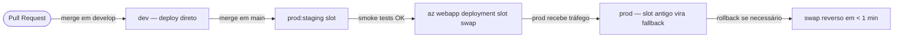

# ADR-005 — Estratégia de Deploy: Blue/Green com Azure App Service Deployment Slots

**Status:** Aceito  
**Data:** 2026-06-10  
**Autores:** Par 5 · Operações (DevOps Engineer)  
**Contexto:** Estágio 3 — Implementação / Estágio 4 — Evolução  

---

## Contexto

O SIFAP 2.0 processa ~3,8 milhões de pagamentos mensais para beneficiários de programas sociais. Um deploy com downtime em horário de processamento gera impacto direto em beneficiários e risco regulatório. O sistema legado Natural/Adabas não tinha estratégia de deploy automatizada — deploys eram manuais, com janela de manutenção e rollback manual.

Precisamos de uma estratégia de deploy que:
1. Permita rollback em < 5 minutos sem reimplantação de imagem.
2. Não cause downtime durante o ciclo mensal (janela crítica: dias 5-10 de cada mês).
3. Seja simples de operar (um único comando ou botão para swap/rollback).
4. Permita smoke tests antes de promover tráfego para produção.

---

## Decisão

**Adotamos Blue/Green via Azure App Service Deployment Slots** para os ambientes `stage` e `prod`.

O ambiente `dev` usa deploy direto (sem slot) por simplicidade e custo.

### Fluxo de promoção



### Configuração do slot

| Slot | Tráfego | Uso |
|------|---------|-----|
| `production` | 100% | Versão atual estável |
| `staging`    | 0%   | Nova versão aguardando validação |

O slot `staging` tem:
- Variáveis de ambiente com flag `Deployment slot setting = false` — são **swapped** junto com o slot.
- A connection string do banco de **stage** apontada para o mesmo PostgreSQL de prod, mas com schema separado (quando aplicável).

---

## Alternativas consideradas

| Alternativa | Por que descartada |
|-------------|-------------------|
| **Rolling deploy** (padrão App Service) | Sem rollback instantâneo; cliente pode pegar versão antiga e nova na mesma sessão |
| **Canary com Traffic Manager** | Complexidade operacional desproporcional para o tamanho atual do time (Par 5 = 2 pessoas) |
| **Kubernetes + ArgoCD** | Custo e complexidade excessivos para MVP; revisitar no Estágio 4 se escala exigir |
| **Janela de manutenção** (legado) | Inaceitável para sistema 24/7 pós-modernização; não usa capacidades modernas da plataforma |

---

## Consequências

### Positivas
- Rollback em < 1 minuto via `az webapp deployment slot swap --action preview --reverse`.
- Zero downtime durante swap (Azure roteia tráfego atomicamente).
- Smoke tests no slot `staging` antes de qualquer tráfego real.
- Custos adicionais mínimos: App Service Plan já pago; slot extra não tem custo separado para P1v3+.

### Negativas / riscos
- Estado de sessão (se houver) pode ser perdido durante o swap — mitigado com sessões stateless (JWT).
- Slot `staging` precisa de conexão com banco de produção para testes realistas — risco de dados. Mitigado com: smoke tests apenas em endpoints `/actuator/health` e endpoints de leitura (não mutação).
- Desenvolvedores precisam entender que `prod:staging` ≠ `stage environment` — nomenclatura pode confundir. Documentado no runbook.

---

## Implementação no CI/CD

O job `deploy-stage` no [`ci.yml`](../../.github/workflows/ci.yml) implanta no slot `staging`:

```bash
az webapp deployment slot swap \
  --name $WEBAPP_NAME \
  --resource-group $RG \
  --slot staging \
  --target-slot production
```

Rollback manual:
```bash
az webapp deployment slot swap \
  --name $WEBAPP_NAME \
  --resource-group $RG \
  --slot production \
  --target-slot staging
```

---

## Referências

- [Azure App Service deployment slots](https://learn.microsoft.com/azure/app-service/deploy-staging-slots)  
- [ADR-003 Coexistência Strangler Fig](ADR-003-coexistencia-strangler-fig.md) — fluxo de migração de tráfego  
- [CONSTITUTION.md](../../CONSTITUTION.md) — princípio "deploy descrito como código"  
- pipeline-hardening.SKILL.md — OIDC + SHA pinning no CI
