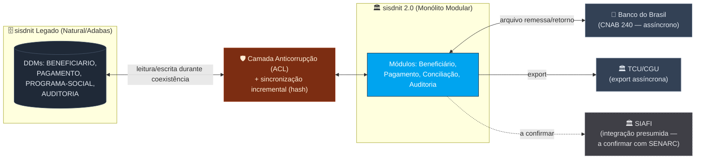

<!-- markdownlint-disable MD013 MD025 MD026 MD028 MD029 MD034 MD040 MD051 MD060 -->

# ADR-004: Integração externa e coexistência com o legado (Strangler Fig)

 

**Status**: accepted

**Date**: 2026-05-19

**Deciders**: Par 2 · Enterprise Architect (topologia/integração) e Software Architect (bounded contexts)

**Context tags**: integration, migration-risk, availability, compliance

## Context

O sisdnit 2.0 não vive isolado. O C4 L1 ([`../c4-diagrams.md`](../c4-diagrams.md)) coloca no contorno os atores internos (operador/gestor SENARC) e os sistemas externos de governo. Cada integração externa tem um contrato com características distintas de acoplamento, disponibilidade e **evidência no legado** — e precisamos decidir como cada uma é tratada sem quebrar o contrato existente.

A força motriz é dupla. Primeiro, a migração **não pode ser big-bang**: a tabela `PAGAMENTO` tem ~180M registros ([`../scope-decisions.md`](../scope-decisions.md), risco de migração) e o ciclo mensal de pagamento dos 2,3 mi de beneficiários ([`../SPECIFICATION.md`](../SPECIFICATION.md)) é sagrado — não pode existir janela em que a folha não rode. Segundo, a folha do legado tem **consumidores downstream desconhecidos** (MYS-006): não podemos assumir que somos o único cliente dos dados.

Restrições conhecidas, ancoradas na arqueologia:

- O retorno bancário é **arquivo CNAB 240** (assíncrono por natureza), processado só nos registros tipo `3` (REQ-REC-001; BR-029/BR-030).
- A trilha de **auditoria** é exigência regulatória (TCU/CGU — MYS-007, risco de compliance em [`../../01-arqueologia/mysteries-found.md`](../../01-arqueologia/mysteries-found.md)) e precisa ser contínua durante toda a coexistência.
- A ordenação por CPF da folha tem consumidores não mapeados (MYS-006) e deve ser preservada até identificá-los (REQ-PAY-008).
- **Premissa a confirmar:** a integração com o **SIAFI** (prestação de contas orçamentária) aparece no C4 L1, mas **não há evidência dela no código legado**. Nas fontes da arqueologia o SIAFI surge apenas como referência cosmética do terminal 3270 (fidelidade visual SIAFI/SIAPE na demo), **não** como integração de dados. Tratamos o SIAFI como integração-alvo presumida, **pendente de confirmação com o SENARC** antes de virar requisito.

## Decision

Adotamos o **Strangler Fig com fachada de integração e coexistência por bounded context** (Opção C). Migramos um contexto por vez (ordem **Beneficiário → Conciliação → Pagamento → Auditoria**, do menor risco ao maior acoplamento financeiro), mantendo o legado como fonte de verdade de cada contexto até seu corte, com uma **camada anticorrupção (ACL)** isolando o modelo moderno dos DDMs legados e **carga incremental validada por hash**. Quanto à integração externa: o **Banco do Brasil** permanece **assíncrono por arquivo (CNAB 240)** e o **TCU/CGU** recebe **exportação assíncrona** de relatórios; o **SIAFI** fica **fora da decisão dura** até ser confirmado (ver Follow-ups).

## Alternatives considered

- **Opção A — Big-bang (desligar o legado e subir o sisdnit 2.0 de uma vez).** Prós: sem período de duplicação; modelo de dados único desde o dia 1; menor complexidade de sincronização. Contras: risco inaceitável para o ciclo mensal (2,3 mi de beneficiários); rollback significa reverter ~180M registros; os consumidores downstream desconhecidos (MYS-006) quebram sem aviso; viola o princípio do PO de proteger o ciclo de pagamento. **Rejeitada.**

- **Opção B — Coexistência permanente (modernizar só a UI, manter o core batch legado).** Prós: menor esforço; mantém o motor de cálculo testado em produção. Contras: perpetua os mistérios e backdoors que o PO decidiu **não** portar (MYS-005/008/014/015/018/019); não paga a dívida técnica; o Natural/Adabas continua sendo risco de pessoal e licença. **Rejeitada.**

- **Opção C — Strangler Fig com ACL e coexistência por contexto. ✅ Escolhida.** Prós: corta um bounded context por vez com rollback isolado; o legado cobre o que ainda não migrou, então o ciclo nunca para; preserva a ordenação por CPF (REQ-PAY-008) enquanto os consumidores de MYS-006 são mapeados; aproveita a estratégia de carga incremental + validação de hash já prevista no scope-decisions. Contras: período de duplicação com sincronização e monitoramento de divergência; exige ACL e (se o SIAFI for confirmado como síncrono) um mecanismo de re-tentativa; cria dependências de sequência entre os pares de implementação.

### Integrações externas (dentro da Opção C)

1. **Banco do Brasil — assíncrono por arquivo (CNAB 240).** Mantém o contrato existente: remessa e retorno por arquivo, processados pelo Batch Runner (REQ-REC-001..003). Sem acoplamento síncrono — a indisponibilidade do banco não trava o ciclo; o processamento de retorno é idempotente por competência (REQ-PAY-002).
2. **TCU/CGU — exportação assíncrona** de relatórios regulatórios, sem dependência em tempo de execução do ciclo.
3. **SIAFI — não decidido nesta ADR.** Como a integração não está comprovada no legado, **não** fixamos aqui o protocolo. A recomendação preliminar, **se confirmada**, é tratá-la de forma assíncrona/desacoplada (outbox + re-tentativa) para que a prestação de contas nunca bloqueie a geração da folha — mas isso vira ADR próprio após confirmação com o SENARC.

## Consequences

### Positive

- O ciclo mensal nunca para: cada contexto é cortado com rollback isolado e o legado cobre o que ainda não migrou.
- O desacoplamento do BB (assíncrono por arquivo) protege a folha de indisponibilidade externa.
- A ACL impede que os backdoors e mistérios do legado (MYS-014/015/018/019) vazem para o modelo moderno — alinhado à decisão do PO de não portá-los.
- Migração de ~180M registros validada por hash, incrementalmente.

### Negative

- Período de duplicação exige sincronização e monitoramento de divergência entre legado e moderno.
- A ACL é complexidade adicional temporária; se o SIAFI for confirmado como síncrono, soma-se um mecanismo de outbox/re-tentativa.
- A ordem de corte cria dependências de sequência entre os pares de implementação.

### Neutral

- O contrato CNAB 240 com o BB é preservado tal como no legado — nem moderniza nem degrada essa interface.
- A integração com o SIAFI permanece em aberto; nenhuma escolha de protocolo é feita até a confirmação, evitando lock-in prematuro.

## Follow-ups

- [ ] Confirmar com o SENARC se existe (e qual é) a integração orçamentária com o SIAFI; abrir ADR-005 dedicado se confirmada.
- [ ] Marcar o nó SIAFI no C4 L1 ([`../c4-diagrams.md`](../c4-diagrams.md)) como "a confirmar" até a validação com o SENARC.
- [ ] Mapear os consumidores downstream da ordenação por CPF (MYS-006) antes do corte do contexto Pagamento.
- [ ] Definir o mecanismo de sincronização incremental + validação de hash na ACL (alinhar com o DBA — schema e campo de hash do DDM).
- [ ] Revisitar a ordem de corte ao final do corte do contexto Beneficiário.

## References

- [`../c4-diagrams.md`](../c4-diagrams.md) — C4 L1 (contexto do sistema e sistemas externos)
- [`../scope-decisions.md`](../scope-decisions.md) — risco de migração de ~180M registros; carga incremental + hash
- [`../SPECIFICATION.md`](../SPECIFICATION.md) — REQ-REC-001..003 (CNAB 240), REQ-PAY-002 (idempotência), REQ-PAY-008 (ordenação por CPF)
- [`../../01-arqueologia/mysteries-found.md`](../../01-arqueologia/mysteries-found.md) — MYS-006 (consumidores desconhecidos), MYS-007 (relatórios regulatórios TCU)
- [`./ADR-001-monolito-modular.md`](./ADR-001-monolito-modular.md) — monólito modular (base da topologia-alvo)

## Caminho não tomado

Big-bang (Opção A) foi descartado por risco ao ciclo mensal; coexistência permanente (Opção B) foi descartada por perpetuar mistérios e backdoors que o PO decidiu remover. O Strangler Fig é o único caminho que protege o beneficiário **e** paga a dívida técnica.
