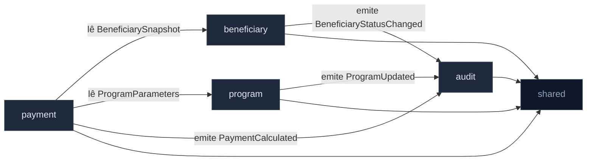
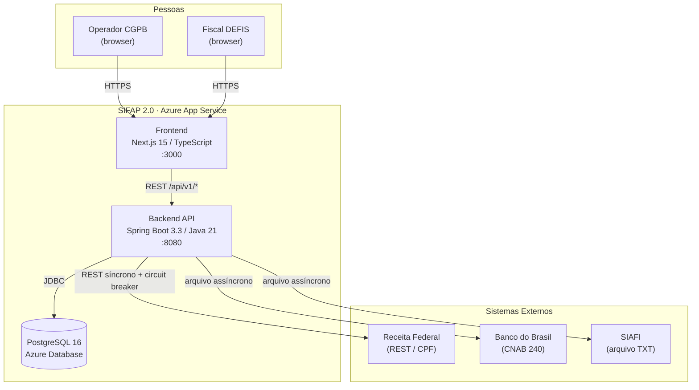
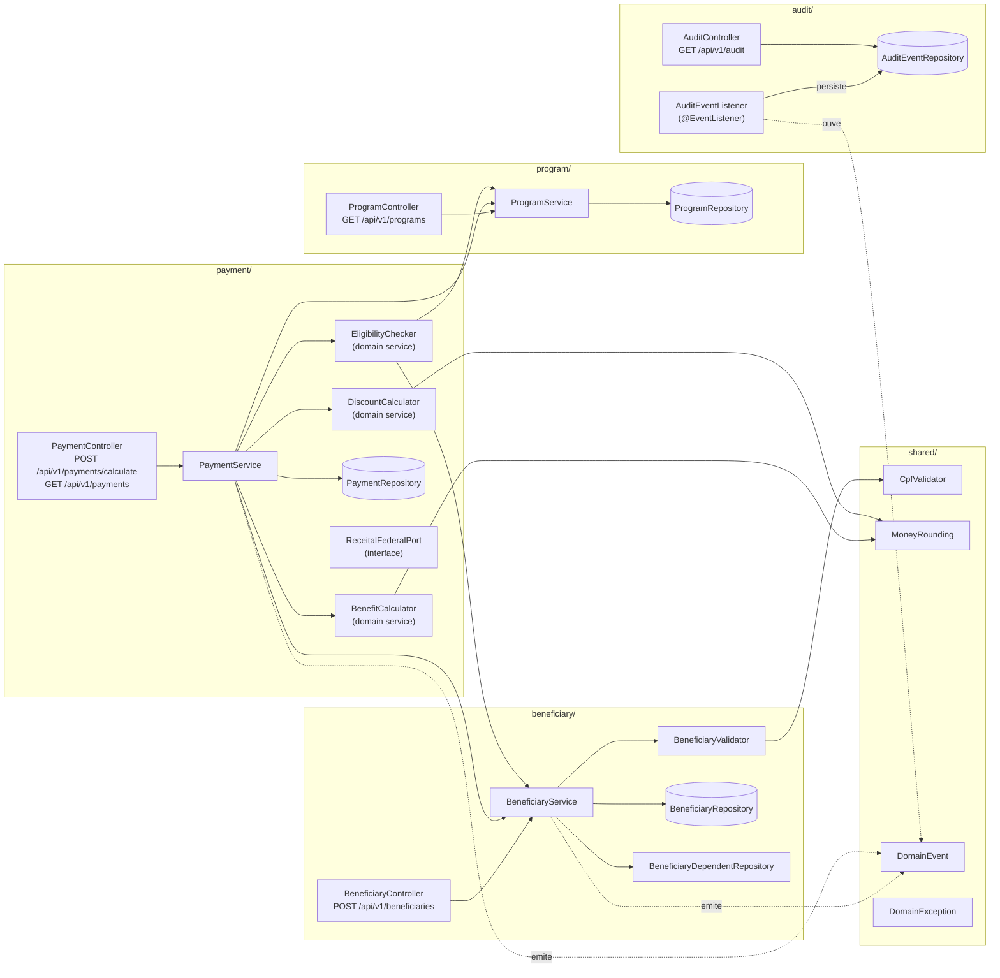

<!-- markdownlint-disable MD013 MD025 MD026 MD028 MD029 MD034 MD040 MD051 MD060 -->

# Mapa de Bounded Contexts — SIFAP 2.0

  

> Produzido pelo **Software Architect** (Par 2) a partir do C4 L1 do Enterprise Architect
> e dos REQ-IDs do Requirements Engineer.
> Entrada direta para o Par 3 (Implementação) na Passagem #2.

**Recebe de**: C4 L1 ([`../01-arqueologia/dependency-map.md`](../01-arqueologia/dependency-map.md)) + EARS ([`SPECIFICATION.md`](SPECIFICATION.md))
**Alimenta**: Par 3 (estrutura de pacotes Spring), Par 4 (schema PostgreSQL por contexto)

---

## 1. Avaliação de hipóteses

### Hipótese A: `eligibility` como contexto separado — **REJEITADO**

| Critério | Avaliação | Evidência |
| --- | --- | --- |
| Coesão | Baixa isolada | `VALELEG.NSN` usa dados de `BENEFICIARIO` + `PROGRAMA-SOCIAL`; sem entidade própria |
| Acoplamento | Muito alto com `beneficiary` e `program` | Lê os dois DDMs; é chamado pelo `BATCHPGT` antes de gerar pagamento |
| Frequência de mudança | Muda junto com regras do `beneficiary` | Toda alteração de elegibilidade toca o cadastro |

**Decisão:** `eligibility` é um serviço de domínio dentro do contexto `payment` (pré-condição do cálculo), não um contexto separado.

### Hipótese B: `program` como contexto separado — **ACEITO (contexto de suporte)**

| Critério | Avaliação | Evidência |
| --- | --- | --- |
| Coesão | Alta | `CADPROG.NSN` / `PROGRAMA-SOCIAL.ddm` têm ciclo de vida próprio (parâmetros por programa) |
| Acoplamento | Baixo (leitura apenas) | Payment e Eligibility apenas leem Program; nunca escrevem |
| Frequência de mudança | Rara (45 programas estáveis) | Última alteração 2015 |

### Hipótese C: separar `calculation` de `payment` — **REJEITADO**

| Critério | Avaliação | Evidência |
| --- | --- | --- |
| Coesão | Artificial | `CALCBENF`, `CALCDSCT` são funções puras do domínio de Payment |
| Acoplamento | Alta coesão de dados | Ambos leem/escrevem o mesmo registro de PAGAMENTO |
| Frequência de mudança | Muda junto | Cada alteração de fórmula afeta ambos |

**Decisão:** `BenefitCalculator` e `DiscountCalculator` são domain services dentro de `payment`.

---

## 2. Bounded Contexts Finais (5)

### `beneficiary`

- **Responsabilidade:** Ciclo de vida do beneficiário — cadastro, validação de CPF, dependentes, máquina de status (ACTIVE/SUSPENDED/CANCELLED/INACTIVE/DISCHARGED).
- **Dados sob ownership:** tabela `beneficiary`, `beneficiary_dependent`, `beneficiary_discount`
- **Interface pública:** `BeneficiaryService` (criar, atualizar, consultar, alterar status), `BeneficiaryValidator` (port)
- **Por que é seu próprio contexto:** Agrega a identidade do beneficiário e seus dependentes; mudanças no cadastro não devem quebrar o ciclo de pagamento. Mapeia diretamente para `BENEFICIARIO.ddm` (FNR 150).
- **REQ-IDs:** REQ-BEN-001 a REQ-BEN-007
- **Legado:** `CADBENEF.NSN`, `CADDEPEND.NSN`, `VALBENEF.NSN`, `VALDOCS.NSN`

### `program`

- **Responsabilidade:** Parametrização de programas sociais — valor-base, regras de elegibilidade, fator de reajuste, faixas de vigência.
- **Dados sob ownership:** tabela `social_program`
- **Interface pública:** `ProgramRepository` (leitura); só `admin` escreve
- **Por que é seu próprio contexto:** Dados de referência estáveis; nenhum outro contexto escreve nele. Mapeia para `PROGRAMA-SOCIAL.ddm` (FNR 151). Dados partilhados por `payment` e `eligibility` via leitura.
- **REQ-IDs:** REQ-PRG-001
- **Legado:** `CADPROG.NSN`

### `payment`

- **Responsabilidade:** Cálculo do benefício mensal, aplicação de fatores (regional, familiar, renda, idade), descontos, arredondamento, geração de pagamento, ciclo mensal.
- **Dados sob ownership:** tabela `payment`, `payment_discount`
- **Interface pública:** `PaymentService` (calcular, consultar), `MonthlyBatchPort` (iniciar ciclo), `BenefitCalculator` (domain service), `DiscountCalculator` (domain service), `EligibilityChecker` (domain service — verifica antes de calcular)
- **Por que é seu próprio contexto:** Concentra o núcleo financeiro; regras de cálculo são independentes do cadastro depois que o beneficiário foi validado. Mapeia para `PAGAMENTO.ddm` (FNR 152).
- **REQ-IDs:** REQ-PAY-001 a REQ-PAY-007, REQ-ELI-001 a REQ-ELI-005 (elegibilidade como pré-condição interna)
- **Legado:** `CALCBENF.NSN`, `CALCDSCT.NSN`, `BATCHPGT.NSN`, `VALELEG.NSN`

### `audit`

- **Responsabilidade:** Trilha imutável de eventos — toda transição de status e cálculo financeiro; relatório de auditoria.
- **Dados sob ownership:** tabela `audit_event` (sem update/delete)
- **Interface pública:** `AuditService.record(AuditEvent)` — chamado por todos os outros contextos via evento de domínio; nunca expõe escrita direta
- **Por que é seu próprio contexto:** Concern transversal; acoplamento mínimo (outros emitem eventos, `audit` os persiste). Corrige o gap do legado (MYS-010: ação `EX` oculta). Mapeia para `AUDITORIA.ddm` (FNR 153).
- **REQ-IDs:** REQ-AUD-001
- **Legado:** `BATCHCON.NSN` (gravaAuditoria), `RELAUDIT.NSN` — gap: ação `EX` era ocultada

### `shared`

- **Responsabilidade:** Kernel compartilhado — exceções padronizadas, mascaramento de CPF, constantes de domínio, base de entidades (sem lógica de negócio).
- **Dados sob ownership:** nenhum
- **Interface pública:** `CpfValidator`, `MoneyRounding` (half-up), `AuditEvent` (record), `DomainException`
- **Por que é seu próprio contexto:** Evita duplicação da validação de CPF (que existe em 3 programas no legado — BR-001); centraliza o arredondamento half-up (REQ-PAY-006).

---

## 3. Comunicação Entre Contextos

| De | Para | Mecanismo | Dados |
| --- | --- | --- | --- |
| `payment` | `beneficiary` | Interface (porta) — leitura síncrona | `BeneficiarySnapshot` (imutável) |
| `payment` | `program` | Interface (porta) — leitura síncrona | `ProgramParameters` (record) |
| `beneficiary` | `audit` | Evento de domínio (`BeneficiaryStatusChanged`) | status anterior, novo, motivo, timestamp |
| `payment` | `audit` | Evento de domínio (`PaymentCalculated`, `PaymentStatusChanged`) | valores, competência, autor |
| `program` | `audit` | Evento de domínio (`ProgramUpdated`) | campo alterado, valor anterior/novo |

**Regra de ouro:** nenhum contexto importa uma classe de `infrastructure` ou `domain` de outro. Apenas interfaces declaradas em `domain/` ou events em `shared/`.



---

## 4. C4 — Nível 2 (Container)

> O SIFAP 2.0 é um único deployable (monolito modular — ADR-001).
> Os containers são os componentes de runtime que o compõem.



---

## 5. C4 — Nível 3 (Componentes do Backend)

> Detalhamento dos componentes internos do container `Backend API`.
> Cada bounded context é um package top-level com suas 3 camadas.



---

## 6. Estrutura de pacotes Spring Boot

```
src/main/java/br/gov/sifap/
├── SifapApplication.java
│
├── beneficiary/
│   ├── domain/
│   │   ├── Beneficiary.java            (@Entity)
│   │   ├── BeneficiaryDependent.java   (@Entity — ex-PE group)
│   │   ├── BeneficiaryDiscount.java    (@Entity — ex-PE group)
│   │   ├── BeneficiaryStatus.java      (enum: ACTIVE, SUSPENDED, ...)
│   │   └── BeneficiaryValidator.java   (interface — port)
│   ├── application/
│   │   └── BeneficiaryService.java
│   └── infrastructure/
│       ├── BeneficiaryController.java
│       ├── BeneficiaryRepository.java  (JpaRepository)
│       └── CpfValidatorAdapter.java    (impl de BeneficiaryValidator)
│
├── program/
│   ├── domain/
│   │   └── SocialProgram.java          (@Entity)
│   ├── application/
│   │   └── ProgramService.java
│   └── infrastructure/
│       ├── ProgramController.java
│       └── ProgramRepository.java
│
├── payment/
│   ├── domain/
│   │   ├── Payment.java                (@Entity)
│   │   ├── PaymentDiscount.java        (@Entity)
│   │   ├── BenefitCalculator.java      (domain service)
│   │   ├── DiscountCalculator.java     (domain service)
│   │   ├── EligibilityChecker.java     (domain service)
│   │   └── MonthlyBatchPort.java       (interface)
│   ├── application/
│   │   └── PaymentService.java
│   └── infrastructure/
│       ├── PaymentController.java
│       ├── PaymentRepository.java
│       └── MonthlyBatchScheduler.java  (impl de MonthlyBatchPort)
│
├── audit/
│   ├── domain/
│   │   └── AuditEvent.java             (@Entity — imutável)
│   ├── application/
│   │   └── AuditEventListener.java     (@EventListener)
│   └── infrastructure/
│       ├── AuditController.java
│       └── AuditEventRepository.java
│
└── shared/
    ├── CpfValidator.java               (utilitário puro)
    ├── MoneyRounding.java              (half-up — REQ-PAY-006)
    ├── DomainEvent.java                (record base)
    ├── DomainException.java            (base para exceções)
    └── audit/
        ├── BeneficiaryStatusChanged.java
        ├── PaymentCalculated.java
        └── ProgramUpdated.java
```

**Regra ArchUnit (CI):** nenhuma classe dentro de `X/domain/` ou `X/infrastructure/` importa classe de `Y/domain/` ou `Y/infrastructure/` onde `X ≠ Y` e `Y ≠ shared`.
