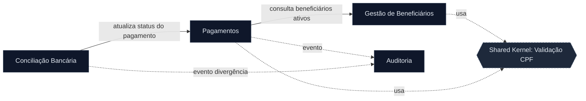

<!-- markdownlint-disable MD013 MD025 MD026 MD028 MD029 MD034 MD040 MD051 MD060 -->

# Mapa de Bounded Contexts — sisdnit 2.0

 

> Artefato preenchido pelo **Par 2 · Arquitetura** (Software Architect) no Estágio 2.
> Base de evidência: `01-arqueologia/business-rules-catalog.md`, `dependency-map.md`, `discovery-report.md`, DDMs Adabas.

## Avaliações de Hipóteses

### Hipótese: "Pagamento e Cálculo como contextos separados" — REJEITADO

| Critério              | Avaliação | Evidência                                                                                   |
| --------------------- | --------- | ------------------------------------------------------------------------------------------- |
| Coesão                | Baixa     | O cálculo (BR-021..BR-026) só existe para gerar o registro de PAGAMENTO; não tem valor isolado. |
| Acoplamento           | Alto      | `BATCHPGT.NSN` calcula e grava na mesma transação; separar criaria chatter síncrono.        |
| Frequência de mudança | Igual     | Fatores e regras de cálculo mudam junto com a folha mensal.                                  |

➡️ Cálculo é um **módulo interno** do contexto de Pagamento, não um contexto próprio.

### Hipótese: "Validação de CPF como contexto próprio" — REJEITADO

| Critério              | Avaliação | Evidência                                                                          |
| --------------------- | --------- | ---------------------------------------------------------------------------------- |
| Coesão                | Baixa     | É uma regra de integridade (BR-003, Módulo 11), não um domínio de negócio.          |
| Acoplamento           | Alto      | Usada por Cadastro e Pagamento; vira biblioteca compartilhada (shared kernel).      |
| Frequência de mudança | Muito baixa | Algoritmo Módulo 11 é estável há décadas.                                          |

➡️ Validação de CPF é um **shared kernel** (utilitário transversal), não um bounded context.

### Hipótese: "Auditoria como contexto próprio" — ACEITO

| Critério              | Avaliação | Evidência                                                                              |
| --------------------- | --------- | -------------------------------------------------------------------------------------- |
| Coesão                | Alta      | Trilha de auditoria (DDM `AUDITORIA`) tem ciclo de vida e compliance próprios.          |
| Acoplamento           | Baixo     | Recebe eventos de diversos contextos (BR-030); não os chama de volta.                   |
| Frequência de mudança | Baixa     | Muda por exigência regulatória, independente das regras de negócio.                     |

## Bounded Contexts Finais

### 1. Gestão de Beneficiários (Beneficiary)

- **Responsabilidade:** Cadastro, consulta e ciclo de vida de beneficiários, dependentes e programas sociais.
- **Dados sob ownership:** DDMs `BENEFICIARIO`, `PROGRAMA-SOCIAL` (e dependentes).
- **Interface pública:** `cadastrarBeneficiário`, `consultarBeneficiário(CPF/NIS)`, `cadastrarProgramaSocial`, `alterarStatusBeneficiário`.
- **Por que é seu próprio contexto:** Concentra regras de identidade e elegibilidade (BR-001..BR-018); muda por política social, não por regra financeira. Shared kernel: validação de CPF (BR-003).

### 2. Pagamentos (Payment)

- **Responsabilidade:** Geração mensal da folha, cálculo do benefício, 13º/abono e descontos.
- **Dados sob ownership:** DDM `PAGAMENTO` (~180M registros).
- **Interface pública:** `gerarFolhaMensal(competência)`, `consultarPagamento`, `recalcularBenefício`.
- **Por que é seu próprio contexto:** Coração financeiro do sistema (BR-019..BR-026); idempotente por competência (BR-020). O cálculo é módulo interno, não contexto separado.

### 3. Conciliação Bancária (Reconciliation)

- **Responsabilidade:** Processar retorno CNAB 240 do Banco do Brasil e atualizar status financeiro dos pagamentos.
- **Dados sob ownership:** Campos de conciliação do `PAGAMENTO` (status pós-banco) + arquivos CNAB.
- **Interface pública:** `processarRetornoCNAB(arquivo)`, `consultarDivergências(competência)`.
- **Por que é seu próprio contexto:** Integração externa com o banco (BR-029, BR-030) com regras e janela temporais próprias; muda por contrato bancário, não por regra de benefício.

### 4. Auditoria (Audit)

- **Responsabilidade:** Registrar trilha imutável de divergências e eventos sensíveis para compliance (TCU/CGU).
- **Dados sob ownership:** DDM `AUDITORIA`.
- **Interface pública:** `registrarEvento(evento)`, `consultarTrilha(filtros)`.
- **Por que é seu próprio contexto:** Requisito regulatório transversal (BR-030); recebe eventos sem acoplar de volta os emissores.

## Comunicação Entre Contextos

| De                  | Para               | Mecanismo            | Dados                                   |
| ------------------- | ------------------ | -------------------- | --------------------------------------- |
| Pagamentos          | Gestão Beneficiários | Consulta síncrona  | Beneficiários ativos, programa, dependentes |
| Conciliação Bancária | Pagamentos         | Comando síncrono     | Atualização de status (P/D/E)           |
| Pagamentos          | Auditoria          | Evento assíncrono    | Eventos de geração/recalculo            |
| Conciliação Bancária | Auditoria          | Evento assíncrono    | Divergências > R$ 0,01 (BR-030)         |

---

**Definição de Pronto:** Hipóteses avaliadas (2 rejeições + 1 aceite documentados), 4 contextos nomeados (entre 2–5), shared kernel identificado, Mermaid renderiza.

> **Escopo Par 2:** estes 4 contextos derivam dos cadastros (Par 1) + batches (Par 2). Pares 3–5 detalham regras internas de cálculo (CALCBENF/CALCCORR/CALCDSCT), validações e relatórios remanescentes dentro destes mesmos contextos.

## Mapeamento Contexto → Pacotes (S3 — layout de módulos)

> Mantido pelo **Software Architect** no Estágio 3. Liga os bounded contexts (acima) à estrutura de pacotes real em [`../03-implementacao/prototipo/backend/`](../03-implementacao/prototipo/backend/). Regra do Modular Monolith: o pacote-raiz de cada contexto é a fronteira; um contexto **não** importa o pacote interno de outro — só sua interface de aplicação. Camadas internas seguem `domain` (regra pura) e `application` (orquestração).

| Bounded Context | Pacote-raiz (`br.gov.client.sisdnit.*`) | Sub-módulos / camadas | Regras (BR) | Programas legados |
| --- | --- | --- | --- | --- |
| Gestão de Beneficiários | `validation`, `eligibility` | `validation.domain` + `validation.application`; `eligibility.domain` + `eligibility.application` | BR-001..018, BR-037..044 | CADBENEF, CADDEPEND, CADPROG, VALBENEF, VALDOCS, VALELEG |
| Pagamentos | `payment` | `payment.domain` + `payment.application` | BR-019..026, BR-031..036 | BATCHPGT, CALCBENF, CALCDSCT, CALCCORR |
| Conciliação Bancária | _(a implementar)_ `reconciliation` | — | BR-029, BR-030 | BATCHCON |
| Auditoria | _(a implementar)_ `audit` | — | BR-030, BR-049, BR-050 | RELAUDIT |

> ℹ️ **Shared kernel:** `validation.domain.Cpf` (Módulo 11, BR-003/BR-037) é utilitário transversal candidato a extração para um pacote `shared`/`kernel` quando o contexto de Pagamentos passar a validar CPF diretamente. Hoje vive em `validation` por ser onde nasceu.

### Review estrutural (fronteiras de contexto)

Auditoria de imports internos (`import br.gov.client.sisdnit.*`) no código atual:

| Import que cruza pacote-raiz | Origem → Destino | Mesmo contexto? | Veredito |
| --- | --- | --- | --- |
| `eligibility.application.ElegibilidadeService` → `validation.domain.ValidationResult` | `eligibility` → `validation` | **Sim** (ambos no contexto Beneficiários) | ✅ Intra-contexto — legítimo. Não é violação de bounded context. |

- **Demais imports:** todos dentro do próprio pacote-raiz (`payment.application` → `payment.domain`, `validation.application` → `validation.domain`). Nenhuma violação de fronteira de contexto.
- **Critério A3 atendido:** nenhum import cruza fronteira de **bounded context** sem justificativa. O único import inter-pacote (`eligibility` → `validation`) é interno ao contexto Beneficiários e está documentado acima.
- **Pendência de modularidade:** `validation` e `eligibility` são dois pacotes-raiz para o **mesmo** contexto. Recomenda-se, quando houver tempo, consolidá-los sob um pacote-raiz `beneficiary` (`beneficiary.registration`, `beneficiary.validation`, `beneficiary.eligibility`) para que o layout reflita 1 pacote-raiz por contexto. Registrado como dívida, não bloqueante.
