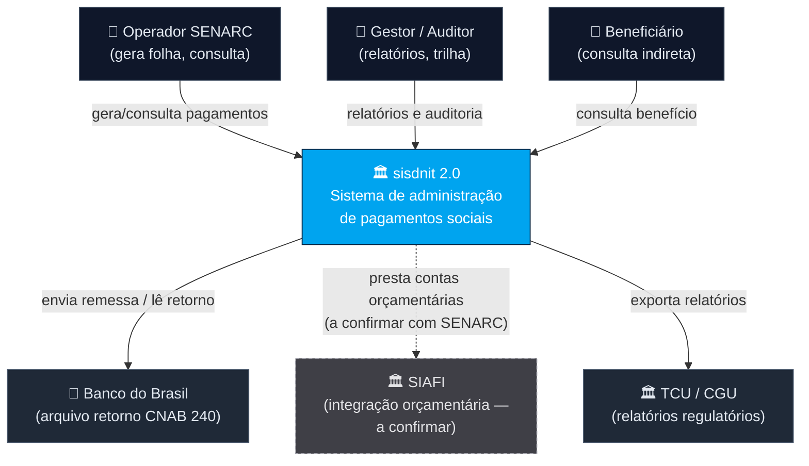
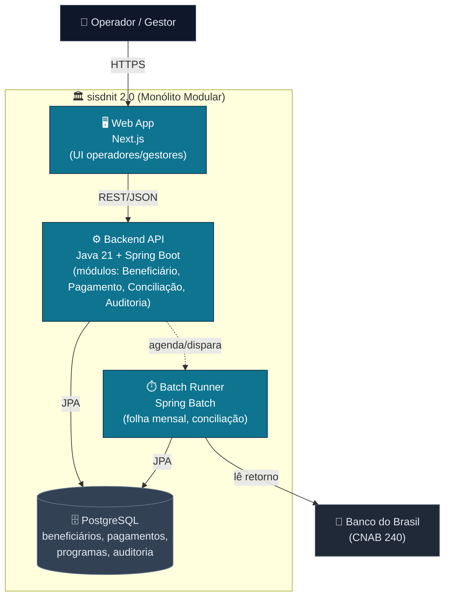
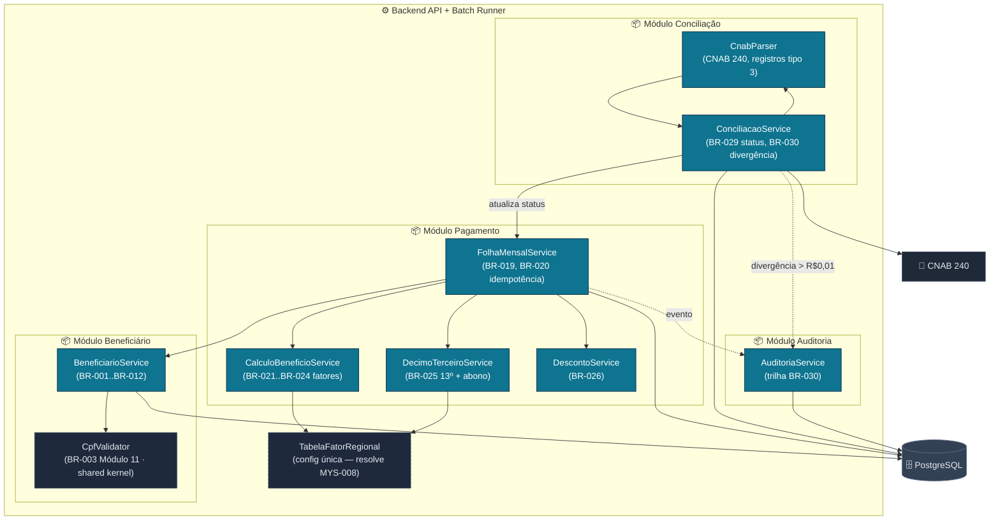

<!-- markdownlint-disable MD013 MD025 MD026 MD028 MD029 MD034 MD040 MD051 MD060 -->

# Diagramas C4 — sisdnit 2.0

 

> Artefato do **Par 2 · Arquitetura**. C4 L1 (System Context) pelo Enterprise Architect; C4 L2/L3 (Containers/Components) pelo Software Architect.
> Base: `bounded-contexts.md`, `01-arqueologia/discovery-report.md`, `dependency-map.md`.

---

## C4 Nível 1 — Contexto do Sistema

Mostra o sisdnit 2.0 como uma caixa e seus atores/sistemas externos.

> **Rastreabilidade dos sistemas externos.** BB/CNAB 240 (BR-029/BR-030, REQ-REC-001..003) e TCU/CGU (MYS-007 — relatórios regulatórios) estão ancorados na arqueologia. O **SIAFI não tem evidência de integração no legado** — aparece apenas como referência cosmética do terminal 3270 (fidelidade visual SIAFI/SIAPE na demo). É uma integração-alvo **presumida, a confirmar com o SENARC** (ver [`adr/ADR-004-integracao-coexistencia.md`](adr/ADR-004-integracao-coexistencia.md)).

---

## C4 Nível 2 — Containers

Decompõe o sisdnit 2.0 em aplicações/serviços executáveis e armazéns de dados. Monólito modular (ver `adr/ADR-001`).

---

## C4 Nível 3 — Componentes (Backend API + Batch)

Detalha os componentes internos alinhados aos bounded contexts. Foco do Par 2: módulo de **Pagamento** e **Conciliação** (batches).

---

**Definição de Pronto:** L1 (atores + sistemas externos), L2 (containers + tecnologias), L3 (componentes rastreados a BR-XXX), todos os Mermaid renderizam. Decisão de topologia (monólito modular) registrada em `adr/ADR-001-monolito-modular.md`.
