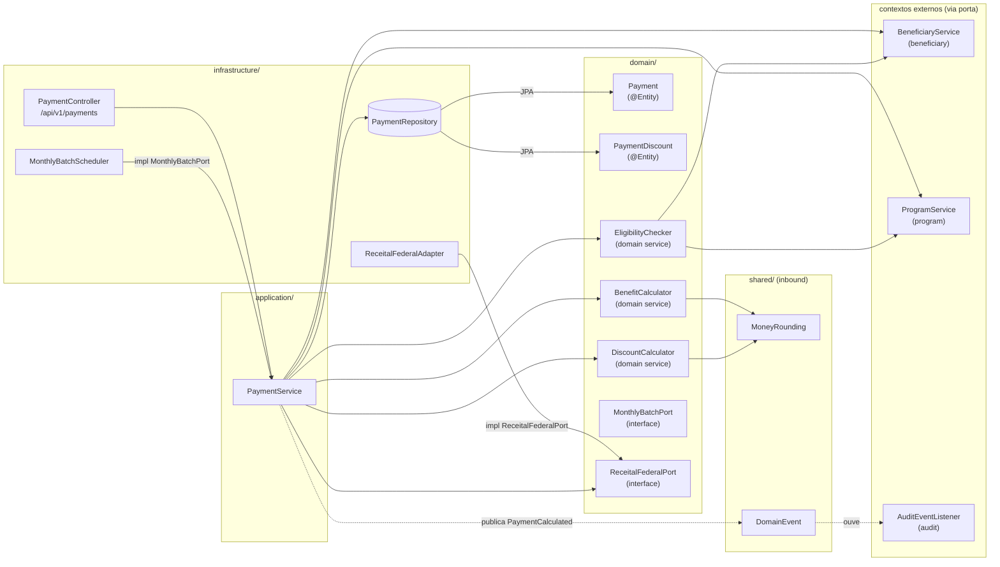

<!-- markdownlint-disable MD013 MD025 MD026 MD028 MD029 MD034 MD040 MD051 MD060 -->

# Mapa de Código — payment

> Última revisão: 2026-06-10 — owner: @software-architect — nível: serviço.
> Gerado a partir do prompt `/codemap` com base na SPECIFICATION.md e nos programas Natural de origem.

## 1. Diagrama de componentes



## 2. Inventário de componentes

| Camada | Classe / Interface | Papel | Inbound | Outbound |
| --- | --- | --- | --- | --- |
| `infrastructure` | `PaymentController` | REST adapter para `/api/v1/payments` | HTTP | `PaymentService` |
| `infrastructure` | `PaymentRepository` | JPA — persiste `Payment`, `PaymentDiscount` | `PaymentService` | PostgreSQL |
| `infrastructure` | `MonthlyBatchScheduler` | Cron mensal; implementa `MonthlyBatchPort` | cron `@Scheduled` | `PaymentService` |
| `infrastructure` | `ReceitalFederalAdapter` | HTTP client (circuit breaker); implementa `ReceitalFederalPort` | `PaymentService` (via porta) | Receita Federal REST |
| `application` | `PaymentService` | Orquestra cálculo, elegibilidade, persistência e publicação de eventos | `PaymentController`, `MonthlyBatchScheduler` | `BenefitCalculator`, `DiscountCalculator`, `EligibilityChecker`, `PaymentRepository`, `BeneficiaryService`, `ProgramService`, `ReceitalFederalPort` |
| `domain` | `Payment` | Entidade JPA — agrega pagamento mensal (competência, valor bruto, líquido, status) | `PaymentRepository` | — |
| `domain` | `PaymentDiscount` | Entidade JPA — descontos associados ao `Payment` (PE group do Adabas DSCT) | `PaymentRepository` | — |
| `domain` | `BenefitCalculator` | Domain service puro — aplica fórmula `VLR-BASE × FATOR-REG × FATOR-FAM × FATOR-RND × FATOR-IDADE × (1 + FATOR-REAJ)` | `PaymentService` | `MoneyRounding` (shared) |
| `domain` | `DiscountCalculator` | Domain service puro — aplica descontos por tipo, cap 30%, half-up | `PaymentService` | `MoneyRounding` (shared) |
| `domain` | `EligibilityChecker` | Domain service — verifica status, renda, idade, tipo/código de programa antes de calcular | `PaymentService` | `BeneficiaryService` (porta), `ProgramService` (porta) |
| `domain` | `MonthlyBatchPort` | Interface — contrato de início do ciclo mensal (Strangler Fig: implementação legacy vs. nova) | — | `MonthlyBatchScheduler` (impl) |
| `domain` | `ReceitalFederalPort` | Interface — contrato de validação de CPF junto à Receita Federal | — | `ReceitalFederalAdapter` (impl) |

## 3. Linhagem Legada (Natural → Java)

| Programa Natural | Linha(s) chave | Componente Java | Observação |
| --- | --- | --- | --- |
| `CALCBENF.NSN` | L12–L67 | `BenefitCalculator` | Fórmula principal; constante 0.347215 vira `VLR-BASE` parametrizável (REQ-PRG-001) |
| `CALCDSCT.NSN` | L14–L58 | `DiscountCalculator` | Cap 30% preservado (BR-026 → REQ-PAY-007); truncamento → half-up (REQ-PAY-006) |
| `CALCBENF.NSN` | L39–L52 | `BenefitCalculator.applyDecemberBonus()` | 13º + abono 15% (BR-023/024 → REQ-PAY-004/005) |
| `VALELEG.NSN` | L1–L90 | `EligibilityChecker` | Lógica de region-99 → exceção controlada (MYS-008 → REQ-ELI-005) |
| `BATCHPGT.NSN` | todo | `MonthlyBatchScheduler` + `PaymentService` | Lógica inline de CALCBENF/CALCDSCT duplicada — **não migrar duplicata**; usar domain services |
| `CALCCORR.NSN` | L96–L110 | **DESCARTADO** | Bloco "Plano Verão" — código morto (EGG-001) |

## 4. Rastreabilidade REQ-ID

| Componente | REQ-IDs implementados | Status |
| --- | --- | --- |
| `BenefitCalculator` | REQ-PAY-001, REQ-PAY-002, REQ-PAY-003, REQ-PAY-004, REQ-PAY-005 | 🔲 a implementar |
| `DiscountCalculator` | REQ-PAY-007, REQ-PAY-006 (half-up) | 🔲 a implementar |
| `EligibilityChecker` | REQ-ELI-001, REQ-ELI-002, REQ-ELI-003, REQ-ELI-004, REQ-ELI-005 | 🔲 a implementar |
| `PaymentService` | REQ-PAY-001 (orquestração) | 🔲 a implementar |
| `PaymentController` | REQ-PAY-001 (REST adapter) | 🔲 a implementar |
| `MonthlyBatchScheduler` | REQ-PAY-001 (ciclo batch) | 🔲 a implementar |
| `ReceitalFederalAdapter` | REQ-BEN-002 (validação CPF externa) | 🔲 a implementar |

**Componentes sem REQ-ID:** `MonthlyBatchPort`, `ReceitalFederalPort` — são contratos internos; rastreiam indiretamente via implementadores.

## 5. Architecture Smells identificados

| Smell | Componente | Risco | Mitigação |
| --- | --- | --- | --- |
| Lógica duplicada no legado (`BATCHPGT` duplica `CALCBENF`/`CALCDSCT`) | `MonthlyBatchScheduler` | Médio | Scheduler chama `BenefitCalculator` e `DiscountCalculator`; nunca reinlina |
| `EligibilityChecker` tem 2 dependências externas (cross-context) | `EligibilityChecker` | Baixo | Via interfaces; testável com mocks |
| Constante mágica `0.347215` (BR-016) | `BenefitCalculator` | Alto | Extrair para `SocialProgram.valorBase` (parametrizável via REQ-PRG-001) |

## 6. OpenAPI — Endpoints do contexto `payment`

```yaml
openapi: "3.1.0"
info:
  title: "SIFAP 2.0 — Payment API"
  version: "1.0.0"
paths:
  /api/v1/payments/calculate:
    post:
      operationId: calculatePayment
      summary: "Calcula o benefício mensal de um beneficiário (REQ-PAY-001)"
      requestBody:
        required: true
        content:
          application/json:
            schema:
              $ref: "#/components/schemas/PaymentCalculationRequest"
      responses:
        "200":
          description: "Cálculo realizado"
          content:
            application/json:
              schema:
                $ref: "#/components/schemas/PaymentResult"
        "404":
          description: "Beneficiário não encontrado"
        "422":
          description: "Beneficiário não elegível (REQ-ELI-001 a ELI-005)"
  /api/v1/payments:
    get:
      operationId: listPayments
      summary: "Lista pagamentos por beneficiário e competência"
      parameters:
        - name: beneficiaryId
          in: query
          required: true
          schema:
            type: string
            format: uuid
        - name: competencia
          in: query
          required: false
          schema:
            type: string
            pattern: "^\\d{4}-\\d{2}$"
      responses:
        "200":
          description: "Lista de pagamentos"
components:
  schemas:
    PaymentCalculationRequest:
      type: object
      required: [beneficiaryId, competencia]
      properties:
        beneficiaryId:
          type: string
          format: uuid
        competencia:
          type: string
          pattern: "^\\d{4}-\\d{2}$"
    PaymentResult:
      type: object
      properties:
        paymentId:
          type: string
          format: uuid
        valorBruto:
          type: number
          format: decimal
        valorLiquido:
          type: number
          format: decimal
        competencia:
          type: string
        decimo:
          type: boolean
        descontos:
          type: array
          items:
            $ref: "#/components/schemas/DiscountItem"
    DiscountItem:
      type: object
      properties:
        tipo:
          type: string
        valor:
          type: number
          format: decimal
```
