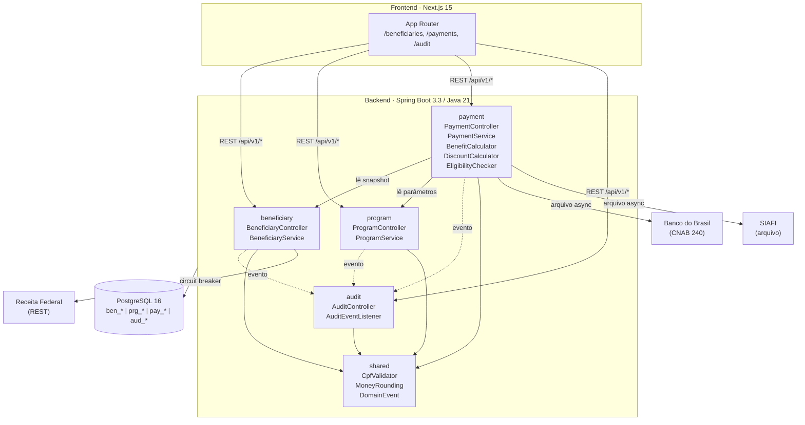

# CODEMAP.md — SIFAP 2.0

> Mapa de código top-level. Mantido pelo **Technical Lead** (Par 3).
> Para detalhamento por serviço, veja [`03-implementacao/codemap-payment.md`](03-implementacao/codemap-payment.md).
> Última revisão: 2026-06-10

---

## Modules

| Módulo | Package raiz | Responsabilidade principal | Legado de origem |
| --- | --- | --- | --- |
| `beneficiary` | `br.gov.sifap.beneficiary` | Ciclo de vida do beneficiário — cadastro, status, dependentes, validação de CPF | `CADBENEF.NSN`, `CADDEPEND.NSN`, `VALBENEF.NSN`, `VALDOCS.NSN` · FNR 150 |
| `program` | `br.gov.sifap.program` | Parâmetros de programas sociais (valor-base, reajuste, vigência) | `CADPROG.NSN` · FNR 151 |
| `payment` | `br.gov.sifap.payment` | Cálculo do benefício mensal, descontos, elegibilidade, batch | `CALCBENF.NSN`, `CALCDSCT.NSN`, `VALELEG.NSN`, `BATCHPGT.NSN` · FNR 152 |
| `audit` | `br.gov.sifap.audit` | Trilha imutável de eventos de status e cálculo (corrige gap do legado) | `BATCHCON.NSN`, `RELAUDIT.NSN` · FNR 153 |
| `shared` | `br.gov.sifap.shared` | Utilitários cross-cutting — CpfValidator, MoneyRounding, DomainEvent, DomainException | — (GREENFIELD) |

### Estrutura interna de cada módulo

```
<modulo>/
  domain/         ← entidades JPA, domain services, interfaces (ports)
  application/    ← *Service — orquestra casos de uso; @Transactional aqui
  infrastructure/ ← *Controller, *Repository, adapters externos
```

---

## Data Flow

### Fluxo de cadastro de beneficiário

```
POST /api/v1/beneficiaries
  → BeneficiaryController
  → BeneficiaryService (@Transactional)
    → BeneficiaryValidator (port) → CpfValidatorAdapter → Receita Federal (circuit breaker)
    → BeneficiaryRepository → PostgreSQL (ben_beneficiary)
    → ApplicationEventPublisher → BeneficiaryStatusChanged
      → AuditEventListener → AuditEventRepository → PostgreSQL (aud_audit_event)
```

### Fluxo de cálculo mensal (batch)

```
MonthlyBatchScheduler (@Scheduled cron)
  → PaymentService (@Transactional)
    → EligibilityChecker
      → BeneficiaryService (lê BeneficiarySnapshot)
      → ProgramService (lê ProgramParameters)
    → BenefitCalculator (domain service — puro, sem Spring)
      → MoneyRounding.halfUp()
    → DiscountCalculator (domain service — cap 30%, half-up)
      → MoneyRounding.halfUp()
    → PaymentRepository → PostgreSQL (pay_payment, pay_payment_discount)
    → ApplicationEventPublisher → PaymentCalculated
      → AuditEventListener → aud_audit_event
```

### Fluxo de consulta de auditoria

```
GET /api/v1/audit?beneficiaryId=&competencia=
  → AuditController
  → AuditEventRepository (somente SELECT — sem UPDATE/DELETE)
  → PostgreSQL (aud_audit_event)
```

---

## External Integrations

| Sistema externo | Tipo | Adapter | Contrato | ADR |
| --- | --- | --- | --- | --- |
| Receita Federal (CPF) | REST síncrono | `ReceitalFederalAdapter` | REST + circuit breaker 5s; fallback `PENDING_RF` | ADR-002 |
| Banco do Brasil / CAIXA | Arquivo CNAB 240 (assíncrono) | `CnabExportAdapter` *(Stage 3+)* | Geração de remessa CNAB 240 | ADR-002 |
| SIAFI | Arquivo TXT (assíncrono) | `SiafiExportAdapter` *(Stage 3+)* | Conciliação orçamentária | ADR-002, ADR-003 |
| CadÚnico | Arquivo batch (assíncrono) | `CadunicoSyncAdapter` *(Stage 3+)* | Atualização de renda/família | ADR-002 |

> Integrações marcadas `Stage 3+` estão fora do escopo v1 mas os adapters devem ter interfaces declaradas em Stage 3 para facilitar o Strangler Fig (ADR-003).

---

## Diagrama top-level



---

## REQ-ID → Módulo (rastreabilidade rápida)

| REQ-IDs | Módulo | Componente chave |
| --- | --- | --- |
| REQ-BEN-001 a 007 | `beneficiary` | `BeneficiaryService`, `BeneficiaryController` |
| REQ-PRG-001 | `program` | `ProgramService` |
| REQ-PAY-001 a 007 | `payment` | `PaymentService`, `BenefitCalculator`, `DiscountCalculator` |
| REQ-ELI-001 a 005 | `payment` | `EligibilityChecker` |
| REQ-AUD-001 | `audit` | `AuditEventListener`, `AuditEventRepository` |

---

## Architecture smells ativos

| Smell | Módulo | Severidade | Issue |
| --- | --- | --- | --- |
| Constante mágica `0.347215` no legado `CALCBENF.NSN#L12` | `payment` | 🔴 Alta | Resolvido em F3-T01 — migrar para `SocialProgram.valorBase` |
| `EligibilityChecker` tem 2 deps cross-context | `payment` | 🟡 Média | Aceitável; via interfaces documentadas em codemap-payment |
| `BATCHPGT.NSN` duplica lógica de `CALCBENF`/`CALCDSCT` | legado | 🔴 Alta | **Não migrar duplicata** — `MonthlyBatchScheduler` usa domain services |
